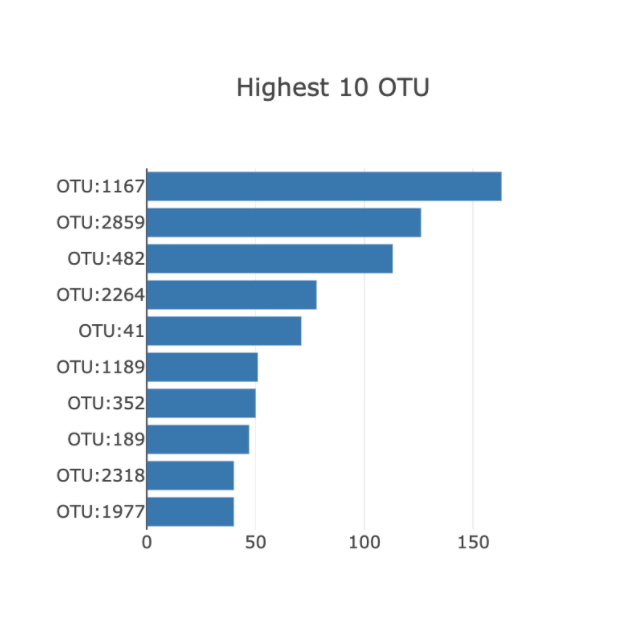

# Plotly Challenge

In this assignment, I created an interactive dashboard to explore the [Belly Button Biodiversity dataset](http://robdunnlab.com/projects/belly-button-biodiversity/), which catalogs the microbes that colonize human navels.

The dataset reveals that a small handful of microbial species (also called operational taxonomic units, or OTUs, in the study) were present in more than 70% of people, while the rest were relatively rare.

My plan in creating this interactice dashboard:

## Step 1: Plotly

1. Use the D3 library to read in `samples.json`.

2. Create a horizontal bar chart with a dropdown menu to display the top 10 OTUs found in that individual.

* Use `sample_values` as the values for the bar chart.

* Use `otu_ids` as the labels for the bar chart.

* Use `otu_labels` as the hovertext for the chart.

This is how the horizontal bar chart looks like:

3. Create a bubble chart that displays each sample.

* Use `otu_ids` for the x values.

* Use `sample_values` for the y values.

* Use `sample_values` for the marker size.

* Use `otu_ids` for the marker colors.

* Use `otu_labels` for the text values.

This is how the bubble bar chart looks like:

4. Display the sample metadata, i.e., an individual's demographic information.
This is how the demographic information table looks like:

5. Display each key-value pair from the metadata JSON object somewhere on the page.

6. Update all of the plots any time that a new sample is selected.

Here's how a landing page looks like with initial test subject with Id number 940:

Since this dashbaord is interactive, charts change as a user chooses a different test subject. Here's a look of another test subject with ID number 958:
